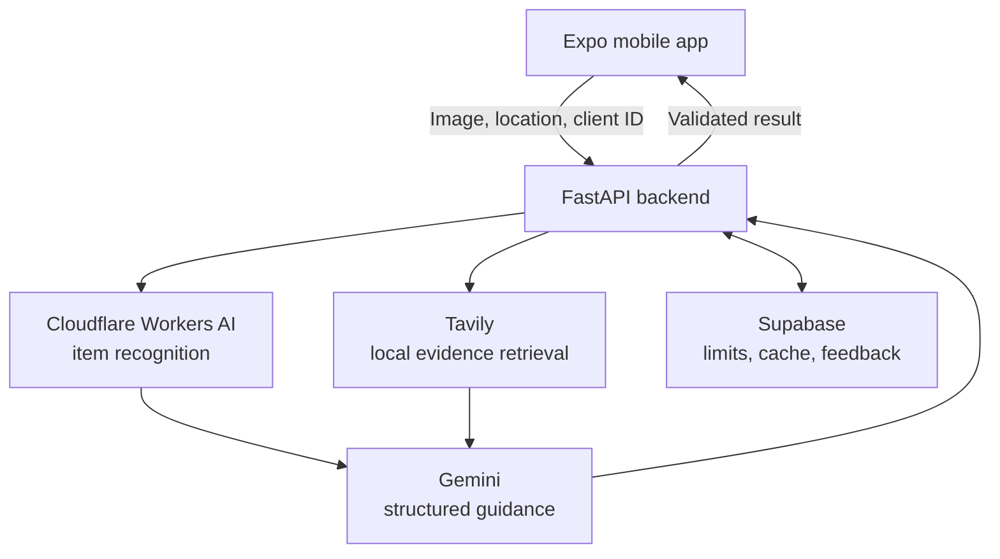

<div align="center">
  

  # Green Bin

  **Point. Scan. Sort smarter. ♻️**

  Green Bin turns a quick photo into clear, location-aware disposal guidance—helping people decide whether an item belongs in recycling, compost, trash, donation, or a special drop-off location.

  [Join the closed test](https://play.google.com/apps/testing/com.mallelalabs.greenbin) · [View on Google Play](https://play.google.com/store/apps/details?id=com.mallelalabs.greenbin) · [Privacy Policy](https://joyiss.github.io/green-bin-legal/) · [Report an issue](../../issues)

  
  
  
  
</div>

> [!NOTE]
> Green Bin is under active development and may be available through closed testing. Disposal rules vary by location, so users should confirm important guidance with their local waste authority.

## Table of contents

- [Try Green Bin](#try-green-bin)
- [Why Green Bin?](#why-green-bin)
- [Features](#features)
- [How it works](#how-it-works)
- [Tech stack](#tech-stack)
- [Project structure](#project-structure)
- [Getting started](#getting-started)
- [Backend configuration](#backend-configuration)
- [Database setup](#database-setup)
- [API reference](#api-reference)
- [Development checks](#development-checks)
- [Troubleshooting](#troubleshooting)
- [Security](#security)
- [Contributing](#contributing)

## Try Green Bin

Want to test the app? Green Bin is currently available to Android users through Google Play closed testing. It takes three quick steps:

1. **Join the tester group** using the Google account connected to your Play Store:  
   [Join the Green Bin Closed Testers Google Group →](https://groups.google.com/g/green-bin-closed-testers)
2. **Opt in to the test** and select **Become a tester**:  
   [Open the Green Bin testing page →](https://play.google.com/apps/testing/com.mallelalabs.greenbin)
3. **Download Green Bin** from Google Play:  
   [Install Green Bin →](https://play.google.com/store/apps/details?id=com.mallelalabs.greenbin)

> [!TIP]
> After installing, try scanning an item that is genuinely confusing to dispose of—such as mixed-material packaging, an old cable, or a takeout container. Feedback on unclear or inaccurate guidance is especially helpful.

## Why Green Bin?

| 📸 Scan | 📍 Localize | ♻️ Act |
| :---: | :---: | :---: |
| Take a photo of an item | Match guidance to nearby rules and services | Follow a clear next step |

## Features

- 📸 **Camera-based scanning** identifies an item from a photo.
- 📍 **Location-aware guidance** adapts disposal instructions to local rules when enough evidence is available.
- 🧾 **Clear result sheets** show the recommended action, warnings, and supporting sources.
- 🗺️ **Nearby drop-off search** helps users find appropriate disposal locations.
- 🕘 **Scan history** makes it easy to revisit earlier results.
- 👍 **Built-in feedback** lets testers rate scan guidance and report problems.
- 🛡️ **Usage and search budgets** protect third-party services from unexpected traffic.

## How it works



For a new scan, the backend recognizes the uploaded image, retrieves relevant local evidence when eligible, makes one structured Gemini guidance call, validates the result, and returns it to the app. Cache hits, clarification responses, and insufficient-evidence fallbacks skip the text-model call.

## Tech stack

| Layer | Technology | Purpose |
| --- | --- | --- |
| Mobile | [Expo](https://docs.expo.dev/) + React Native | Cross-platform app and device APIs |
| Navigation | [Expo Router](https://docs.expo.dev/router/introduction/) | File-based routing |
| API | [FastAPI](https://fastapi.tiangolo.com/) + Uvicorn | Python HTTP backend |
| Vision | [Cloudflare Workers AI](https://developers.cloudflare.com/workers-ai/) | Uploaded-image recognition |
| Guidance | [Google Gemini API](https://ai.google.dev/gemini-api/docs) | Structured disposal guidance |
| Retrieval | [Tavily Search](https://docs.tavily.com/) | Local disposal evidence |
| Data | [Supabase](https://supabase.com/docs) | PostgreSQL storage, limits, cache, and feedback |

## Project structure

```text
green-bin-app/
├── app/                         # Expo Router screens
│   └── (tabs)/index.tsx         # Scanner entry point
├── assets/                      # App icons and other static assets
├── components/                  # Reusable React Native components
├── backend/
│   ├── main.py                  # FastAPI application
│   ├── requirements.txt         # Python dependencies
│   ├── migrations/              # Supabase SQL migrations
│   └── queries/                 # Feedback review queries
├── app.json                     # Expo configuration
├── package.json                 # Mobile scripts and dependencies
└── README.md
```

## Getting started

### Prerequisites

Install the following before continuing:

- [Node.js](https://nodejs.org/) and npm
- [Python](https://www.python.org/downloads/) and pip
- [Expo Go](https://expo.dev/go) on a physical device, or an Android/iOS emulator
- A [Supabase](https://supabase.com/) project for database-backed features
- API credentials for the enabled AI and search providers

### 1. Clone the repository

```bash
git clone <your-repository-url>
cd green-bin-app
```

Replace `<your-repository-url>` with this repository's HTTPS or SSH clone URL.

### 2. Install the mobile dependencies

```bash
npm install
```

### 3. Set up the Python backend

From the repository root:

```bash
python -m venv .venv
```

Activate the environment:

```bash
# macOS or Linux
source .venv/bin/activate

# Windows PowerShell
.venv\Scripts\Activate.ps1
```

Then install the backend dependencies:

```bash
python -m pip install -r backend/requirements.txt
```

### 4. Configure the backend

Create `backend/.env` and add the variables listed in [Backend configuration](#backend-configuration). Never commit this file.

### 5. Apply the database migrations

Apply the required SQL files in numerical order. See [Database setup](#database-setup) for details.

### 6. Start the backend

```bash
uvicorn backend.main:app --reload --host 0.0.0.0 --port 8000
```

Verify that it is running:

```bash
curl http://localhost:8000/health
```

### 7. Start Expo

In a second terminal, from the repository root:

```bash
npx expo start
```

The scanner calls the backend on port `8000`. A physical device must be on the same network as the development machine.

If Expo cannot determine the correct development host, set the machine's local network IP manually:

```bash
# macOS or Linux
EXPO_PUBLIC_API_HOST_OVERRIDE=192.168.1.100 npx expo start

# Windows PowerShell
$env:EXPO_PUBLIC_API_HOST_OVERRIDE="192.168.1.100"
npx expo start
```

Replace `192.168.1.100` with the development machine's local IP address. Do not use `localhost` when the app is running on a separate physical device.

## Backend configuration

Add these variables to `backend/.env`:

```dotenv
# Cloudflare Workers AI: image recognition
CLOUDFLARE_ACCOUNT_ID=your-cloudflare-account-id
CLOUDFLARE_API_TOKEN=your-workers-ai-api-token
CLOUDFLARE_AI_MODEL=@cf/meta/llama-3.2-11b-vision-instruct

# Google AI Studio: text guidance and catalog matching
GEMINI_API_KEY=your-google-ai-studio-api-key
GEMINI_TEXT_MODEL=gemini-3.5-flash-lite
GEMINI_TEXT_TIMEOUT_SECONDS=20
GEMINI_TEXT_MAX_OUTPUT_TOKENS=700

# Guidance features
ENABLE_LLM_GUIDANCE=true
ENABLE_EARTH911_LLM_MATCHING=true
ENABLE_TAVILY_LOCAL_GUIDANCE=true

# Tavily retrieval and budget limits
TAVILY_API_KEY=your-tavily-api-key
TAVILY_TIMEOUT_SECONDS=10
TAVILY_DAILY_CREDIT_LIMIT=100
TAVILY_MONTHLY_CREDIT_LIMIT=1000

# Per-client scan limits
DAILY_SCAN_LIMIT=5
MONTHLY_SCAN_LIMIT=20
REQUIRE_SCAN_CLIENT_ID=false

# Image cache behavior
ENABLE_CLIP_WARMUP=true
ENABLE_NEAREST_PHASH_LOOKUP=false

# Backend-only Supabase credentials
SUPABASE_URL=your-supabase-project-url
SUPABASE_KEY=your-backend-only-service-role-key
```

### Configuration behavior

| Variable | Default | Notes |
| --- | --- | --- |
| `GEMINI_TEXT_MODEL` | `gemini-3.5-flash-lite` | Used for text-only guidance and Earth911 catalog matching |
| `GEMINI_TEXT_TIMEOUT_SECONDS` | `20` | Maximum duration of a Gemini text request |
| `GEMINI_TEXT_MAX_OUTPUT_TOKENS` | `700` | Output ceiling for structured guidance |
| `ENABLE_TAVILY_LOCAL_GUIDANCE` | `true` | Searches still require a Tavily key and budget migration |
| `TAVILY_TIMEOUT_SECONDS` | `10` | Each eligible scan makes at most one basic search request and never retries it |
| `TAVILY_DAILY_CREDIT_LIMIT` | `100` | Resets at the UTC day boundary |
| `TAVILY_MONTHLY_CREDIT_LIMIT` | `1000` | Resets at the UTC month boundary |
| `DAILY_SCAN_LIMIT` | `5` | Accepted scans per client per UTC day |
| `MONTHLY_SCAN_LIMIT` | `20` | Accepted scans per client per UTC month |
| `REQUIRE_SCAN_CLIENT_ID` | `false` | Set to `true` for closed testing and production |
| `ENABLE_CLIP_WARMUP` | `true` | Initializes CLIP in the background |
| `ENABLE_NEAREST_PHASH_LOOKUP` | `false` | Enable only when approximate matching is worth a full-cache scan |

`CLOUDFLARE_AI_MODEL` controls the image-recognition path only. Gemini handles text-only guidance and Earth911 catalog classification.

## Database setup

Apply these migrations in the [Supabase SQL Editor](https://supabase.com/dashboard) or with your normal migration workflow:

| Order | Migration | Purpose |
| --- | --- | --- |
| 1 | `backend/migrations/004_tavily_search_budget.sql` | Atomically enforces daily and monthly Tavily budgets without storing user or request data |
| 2 | `backend/migrations/005_scan_feedback.sql` | Stores closed-testing feedback with RLS and service-role-only access |
| 3 | `backend/migrations/006_scan_usage_limits.sql` | Atomically enforces per-client scan limits across backend instances |

Feedback review queries are available in `backend/queries/scan_feedback_review.sql`.

Budget reservations fail closed and reset at UTC day or month boundaries. If the Tavily key or budget migration is missing, local search remains unavailable even when its feature flag is enabled.

## API reference

The development API runs at `http://localhost:8000` by default.

| Method | Endpoint | Description |
| --- | --- | --- |
| `GET` | `/health` | Confirms that the backend is available |
| `POST` | `/predict` | Accepts an image and returns validated disposal guidance |

### Example prediction request

`/predict` accepts multipart form data. The uploaded image uses the `file` field.

```bash
curl -X POST http://localhost:8000/predict \
  -H "X-GreenBin-Client-Id: local-development-client" \
  -F "file=@/path/to/item.jpg"
```

When `REQUIRE_SCAN_CLIENT_ID=true`, requests without `X-GreenBin-Client-Id` are rejected before image-recognition work begins.

FastAPI's interactive API documentation is normally available at [`http://localhost:8000/docs`](http://localhost:8000/docs) while the backend is running.

## Development checks

Run these checks before opening a pull request or creating a release build:

```bash
npm run lint
npx tsc --noEmit
npx expo-doctor
npx expo export
```

Also verify both API routes locally and complete at least one end-to-end scan from a device or emulator.

## Troubleshooting

### The app cannot reach the backend

- Confirm that `/health` works on the development machine.
- Keep the phone and computer on the same network.
- Bind Uvicorn to `0.0.0.0`, not only `127.0.0.1`.
- Set `EXPO_PUBLIC_API_HOST_OVERRIDE` to the computer's local IP.
- Allow inbound traffic to port `8000` through the computer's firewall.

### Tavily search does not run

- Confirm that `ENABLE_TAVILY_LOCAL_GUIDANCE=true`.
- Confirm that `TAVILY_API_KEY` is present.
- Apply `004_tavily_search_budget.sql`.
- Check whether the configured UTC daily or monthly budget is exhausted.

### Prediction requests are rejected

- If `REQUIRE_SCAN_CLIENT_ID=true`, make sure the app sends `X-GreenBin-Client-Id`.
- Confirm that the client has not reached its daily or monthly scan limit.
- Apply `006_scan_usage_limits.sql` before enabling production enforcement.

## Security

- Never commit `backend/.env` or real API credentials.
- Never expose `SUPABASE_KEY` in the Expo app; it is a backend-only service-role credential.
- Do not place Cloudflare, Gemini, Tavily, or Supabase service-role secrets in `EXPO_PUBLIC_*` variables. Expo public variables are bundled into the client.
- Keep feedback and limit tables protected by RLS and service-role-only access.
- Set `REQUIRE_SCAN_CLIENT_ID=true` for closed testing and production deployments.
- Rotate any credential immediately if it is committed or shared accidentally.

## Contributing

Feedback, bug reports, and focused improvements are welcome. Before proposing a large change, [open an issue](../../issues) to describe the problem and expected behavior.

When submitting a pull request:

1. Keep changes focused and document any new environment variables.
2. Add or update tests and migrations when behavior changes.
3. Run the checks in [Development checks](#development-checks).
4. Never include secrets, private tester data, or generated build files.

---

<div align="center">
  Built to make local disposal guidance easier to understand.
</div>
